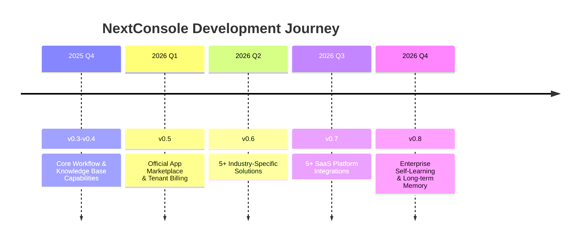
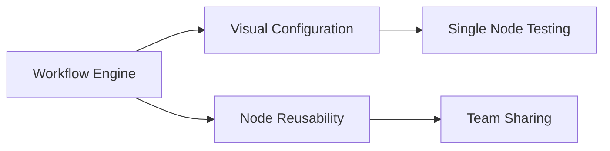
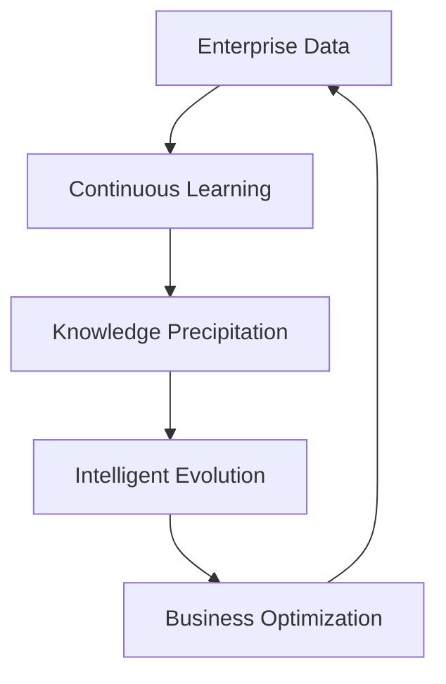

# NextConsole Project Roadmap 🚀

> Last Updated: 2025-12-01 | Current Version: v0.2.5  
> *Roadmap will be dynamically adjusted based on community feedback and development progress*

## 🌟 Vision
Building an enterprise-grade LLM application development platform that enables every organization to quickly create intelligent business assistants and lowers the barrier to AI application development.

---

## 📅 Detailed Plan

### 🛠 2025 Q4 (v0.3.0-0.4.0) - Foundation Building Phase
**Focus**: Workflow Engine & Knowledge Base System

- **Smart Workflow System**: Support for code node fixed logic, Agent loop processing, cross-application node copying
- **Admin Console Upgrade**: New visual interface, Embedding model configuration, XiaoYi Assistant migration framework
- **Knowledge Base Foundation**: Online Wiki editing, document vectorization, intelligent search optimization

---

### 🏪 2026 Q1 (v0.5.0) - Ecosystem Launch
**Focus**: Official App Marketplace & Commercialization Exploration

  
  

- **App Marketplace 1.0**: Official application distribution platform supporting developer publishing and monetization
- **Tenant Management System**: Multi-tenant isolation, resource quotas, usage billing
- **Commercial Foundation**: Subscription management, payment integration, billing system

> 💡 Value for Architects: Enterprise-grade deployment solutions and scalable business models

---

### 🏭 2026 Q2 (v0.6.0) - Industry Solutions
**Focus**: Vertical Industry Application Deep Packaging

  
| Industry Domain | Core Features | Status |
|---------|---------|------|
| Finance | Smart Report Analysis, Data Auditing | 🚧 In Development |
| Approval | Process Automation, Intelligent Routing | 🚧 In Development |
| Customer Service | Multi-turn Dialogue, Sentiment Recognition | 🚧 In Development |
| Operations | Fault Diagnosis, Automated Handling | 🚧 In Development |
| Writing | Content Generation, Style Adaptation | 🚧 In Development |

- **5+ Industry Solutions**: Ready-to-use professional application templates
- **Domain-Optimized Models**: Specially fine-tuned models for specific scenarios
- **Business Data Integration**: Standard connectors for common business systems

> 💡 Value for Developers: Reduce wheel reinvention and deliver industry applications rapidly

---

### 🔗 2026 Q3 (v0.7.0) - Ecosystem Integration
**Focus**: Deep Integration with Mainstream SaaS Platforms

  
  
  
  
  

- **5+ SaaS Platform Integrations**: Message interoperability, user synchronization, unified authentication
- **Hybrid Deployment Mode**: Flexible public cloud + private deployment options
- **Open Ecosystem Protocols**: Standard API interfaces and extension specifications

---

### 🧠 2026 Q4 (v0.8.0) - Intelligent Evolution
**Focus**: Enterprise Self-Learning & Long-term Memory

- **Self-Learning Framework**: Continuous model optimization based on business feedback
- **Long-term Memory System**: Organizational knowledge precipitation and intelligent reuse
- **Personalized Adaptation**: Enterprise-specific AI assistant training platform

> 💡 Value for Enterprises: Build continuously evolving proprietary intelligent capabilities

---

## 🤝 Participation Methods

We welcome various forms of participation:

- **Code Contributions**: Claim tasks labeled `roadmap` in GitHub Issues
- **Solution Discussions**: Submit proposals with `RFC:` prefix in discussion area
- **Ecosystem Partnership**: Become a first-batch developer in the official marketplace
- **Sponsorship Support**: Support project development through Open Collective

---

## 📊 Version Progress Tracking

| Version | Status | ETA | Completion |
|------|------|---------|--------|
| v0.3.0 | 🚧 In Development | 2025-09 | 45% |
| v0.4.0 | 📋 Planned | 2025-10 | 0% |
| v0.5.0 | 📋 Planned | 2026-03 | 0% |
| v0.6.0 | 📋 Planned | 2026-06 | 0% |
| v0.7.0 | 📋 Planned | 2026-09 | 0% |
| v0.8.0 | 📋 Planned | 2026-12 | 0% |

---

> 🌟 **Join Us**: Let's build the next generation enterprise AI application platform together!  
> Visit [GitHub Repository](https://github.com/TuringOpsSH/NextConsole) for more details

*Note: This roadmap will be dynamically adjusted based on technological developments and community feedback. Please refer to project documentation for the latest version*