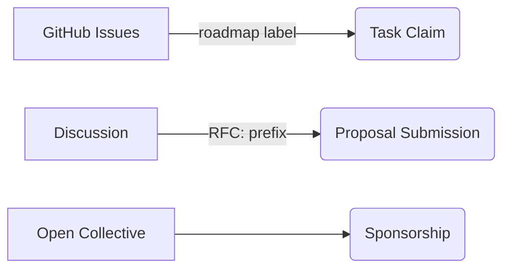

Here's the polished English version of your roadmap, maintaining all structural elements and technical details:

---

# NextConsole Project Roadmap  

> Last Updated: 2025-08-24 | Current Version: v0.2.5  
> *Timeline may adjust based on community feedback*  

## AI Factory Platform Roadmap  

### September 2025 (v0.3.0)  
🛠 **Core Workflow Capabilities**  
- Code node configuration for fixed processing logic (Req 2.1.1)  
- List processing with agent node loops (Req 2.1.2)  
- Cross-application node copy/paste (Req 2.1.4)  
- Single-node test execution (Req 2.1.5)  
- Workflow API visualization (Req 2.1.6)  

⚙️ **Admin Console Upgrade**  
- Management UI redesign (Planned)  
- Embedding model configuration (Req 2.1.13)  
- XiaoYi Assistant migration framework (Req 2.1.10)  

### October 2025 (v0.4.0)  
🔗 **Integration Layer**  
- Team library workflow sharing (Req 2.1.3)  
- JSON-Schema auto-generation from samples (Req 2.1.7)  
- Iframe embedding for third-party apps (Req 2.1.12)  
- SSO support (Req 2.5.27)  

📖 **Knowledge Base MVP**  
- Online Wiki editing/publishing (Req 2.3.16)  
- Document vectorization configuration (Req 2.3.17)  

### November 2025 (v1.0 RC)  
🗣 **Conversational Development**  
- Agent-assisted workflow generation (Req 2.1.8)  
- Output message templates (Req 2.1.11)  

🖥 **Workbench Optimization**  
- Session sharing (image/doc/web) (Req 2.2.14)  
- Personal/team app management hub (Req 2.2.15)  

🗃 **Resource Center Upgrade**  
- Visual knowledge extraction models (Req 2.4.22)  
- Streamlined resource search (Req 2.4.23)  

### December 2025+  
🚀 **Enterprise Features**  
- Multi-tenant support (Planned)  
- API token management (Req 2.5.28)  
- Plugin marketplace MVP (Planned)  
- Complete documentation system (Req 2.5.24)  

🌍 **Globalization**  
- Bilingual documentation (EN/CN) (Planned)  
- Enterprise auth integration (SAML/OAuth) (Planned)  

---

**Planning Notes**:  
1. Three-phase progression: Core → Extensions → Ecosystem  
2. Each version combines user-facing features + backend support  
3. 🔴 Marks critical path items  
4. Parenthetical references maintain traceability  

## Contribution Pathways  

