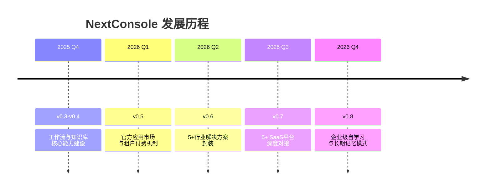
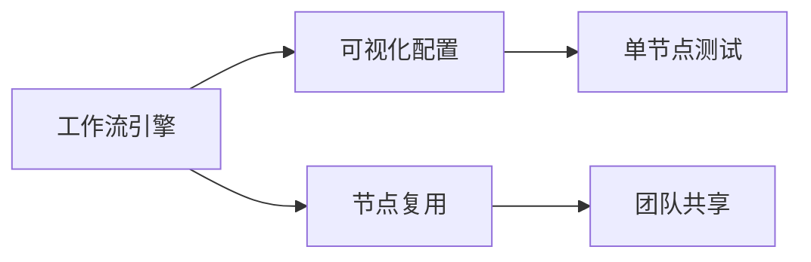
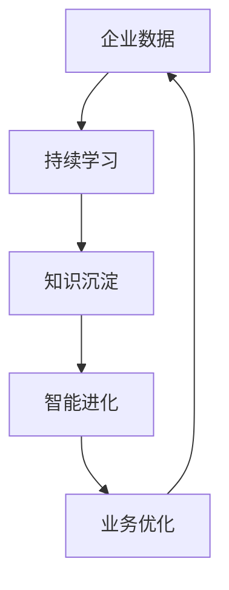

# NextConsole 项目路线图 🚀

> 更新时间：2025-12-01 | 当前版本：v0.2.9
> *路线图将根据社区反馈和开发进展动态调整*

## 🌟 愿景目标
打造企业级LLM应用开发平台，让每个组织都能快速构建智能业务助手，降低AI应用开发门槛。

---

## 📅 详细规划

### 🛠 2025 Q4（v0.3.0-0.4.0） - 基础能力建设期
**核心焦点**：工作流引擎与知识库系统

- **智能工作流系统**：支持代码节点固定逻辑、Agent循环处理、跨应用节点复制
- **管理后台升级**：全新视觉界面、Embedding模型配置、小亦助手迁移框架
- **知识库基础**：在线Wiki编辑、文档向量化构建、智能检索优化

---

### 🏪 2026 Q1（v0.5.0） - 生态启航
**核心焦点**：官方应用市场与商业化探索

  
  

- **应用市场1.0**：官方应用分发平台，支持开发者发布和变现
- **租户管理体系**：多租户隔离、资源配额、用量计费
- **商业化基础**：订阅管理、支付对接、账单系统

> 💡 对架构师的价值：提供企业级部署方案和可扩展的商业模式

---

### 🏭 2026 Q2（v0.6.0） - 行业解决方案
**核心焦点**：垂直行业应用深度封装

  
| 行业领域 | 核心功能 | 状态 |
|---------|---------|------|
| 财务 | 智能报表分析、数据稽核 | 🚧 开发中 |
| 审批 | 流程自动化、智能路由 | 🚧 开发中 |
| 客服 | 多轮对话、情绪识别 | 🚧 开发中 |
| 运维 | 故障诊断、自动化处理 | 🚧 开发中 |
| 写作 | 内容生成、风格适配 | 🚧 开发中 |

- **5+行业解决方案**：开箱即用的专业应用模板
- **领域优化模型**：针对特定场景微调的专用模型
- **业务数据对接**：常见业务系统的标准连接器

> 💡 对开发者的价值：减少重复造轮子，快速交付行业应用

---

### 🔗 2026 Q3（v0.7.0） - 生态集成
**核心焦点**：主流SaaS平台深度对接

  
  
  
  
  

- **5+SaaS平台对接**：消息互通、用户同步、统一认证
- **混合部署模式**：公有云+私有化灵活部署
- **生态开放协议**：标准API接口和扩展规范

---

### 🧠 2026 Q4（v0.8.0） - 智能进化
**核心焦点**：企业级自学习与长期记忆

- **自学习框架**：基于业务反馈的模型持续优化
- **长期记忆系统**：组织知识沉淀与智能复用
- **个性化适配**：企业专属AI助手训练平台

> 💡 对企业的价值：构建不断进化的专属智能能力

---

## 🤝 参与方式

我们欢迎各种形式的参与：

- **代码贡献**：认领GitHub Issues中标注`roadmap`的任务
- **方案讨论**：在讨论区以`RFC:`前缀提交提案
- **生态合作**：成为官方应用市场首批开发者
- **赞助支持**：通过Open Collective支持项目发展

---

## 📊 版本进度跟踪

| 版本 | 状态 | 预计完成 | 完成度 |
|------|------|---------|--------|
| v0.3.0 | 🚧 开发中 | 2025-09 | 45% |
| v0.4.0 | 📋 规划中 | 2025-10 | 0% |
| v0.5.0 | 📋 规划中 | 2026-03 | 0% |
| v0.6.0 | 📋 规划中 | 2026-06 | 0% |
| v0.7.0 | 📋 规划中 | 2026-09 | 0% |
| v0.8.0 | 📋 规划中 | 2026-12 | 0% |

---

> 🌟 **加入我们**：一起打造下一代企业级AI应用平台！  
> 访问 [GitHub仓库](https://github.com/TuringOpsSH/NextConsole) 了解更多详情

*注：本路线图会根据技术发展和社区反馈动态调整，最新版本请访问项目文档*